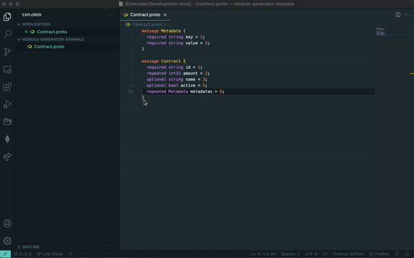

# Introduction

After multiple implementation of services we kind of always need to translater our ideas in class to be used on code. When tou work on oriented object tou have to define each entity of your domain in class and do a kind of monkey job at the begining of your project.

This monkey job can be reduced by generating theses class from a low level language input. the aim here is to generate the basic code that you need to start written your business code from a simple input. Having already your class with some getters / setters and more can be cool when you need to go fast. the service is here only to help you, its dump so sometimes you will need to review it for example for importing the nested classes.

Code generated is Typescripted so we can have object that we can rely on. Wen can have than more that just classes, tests, mappers, schéma and more.

But first lets define some roules on the input that we need and also define what we want as result.

# Input

To define simple message there is the proto definitions, wich is pretty low level language and super simple to understand and use. Here is more informations about protobuf definitions.

So lets define for example a message that we are going tontranslate into Typescript code.

# Services

Some of these services generates also tests so that you have coverages on generated code. All services has a command that you can run separetly but also a general command to have them all. Notice that you have always a second command to it for ES6 supports.

## Props:

From properties it can generate props. The props are the entry definitions used when you want to create your object , update and more. Basically they are not the domain object, it’s more a plenty object that you map after to your object private properties.

## Fixture:

For tests we always want to create a fake object with fake data. This function returns you fake data as props so that you can fill your object from it.

## Getters:

From properties it can generate getter for them. The getters are there to acces to your data when it’s private.

## Setters:

From properties it can generate setter for them. The setters are there to update your data when it’s private.

## Equals:

Function that check every property to define if the object received as input is the same as the actual object.

C## onstructor:

Each class has a constructor function to initialize your object so here we use props input to initialize the properties defined on the class.

## Update:

This function is used to update properties of the object. Takes properties for the input and update the property if it’s defined.

## Interface:

From properties it can generate the interface that you want to export to your domain. Helps you in your typescript application. So that you don’t use your object as a type.

## Mongo schema:

From properties it can generate the interface that you want to export to your repository to express object coming from mongodb. Helps you in your typescript application. Because they have a mongoose id but the rest of properies are the same as your interface.

## Class:

Create a class from your protobuf message after processing the properties listed in it. It contains everything listed above and export it. Generate also a test file link to it.

## Mappers:

For objects sometimes you need to change the format of your object to have a plenty object. You can have multiple format for the return type following the purpose that you need. We have different type of return such as props or protobuf type.

- toProps: returns you the object that you have with props type.

- toProto: returns you the object that you have with protobuf type.

## Nestjs module ( only crud ):

It generates you a simple module for your nestjs application to be directly used. A module contains multiple type of files. For simple usage it creates you only CRUD service for your entity.

- Controller:

  Contains the http routes following REST convention for CRUD operation

- Module:

  Export the module as that you can import it to your main application

- Use Case:

  The pattern usage is simple, a use case file for a simple operation.
  This file contains function that are used on the controller for the CRUD operations defined in it.

## Release Notes

Relevant releases:

### 1.0.0

Initial version

## Roadmap

See the [open issues](https://github.com/hamzaPixl/protobuf-ts-generator/issues) for a list of proposed features (and known issues).

## Contributing

Contributions are what make the open source community such an amazing place to be learn, inspire, and create. Any contributions you make are **greatly appreciated**.

1. Fork the Project
2. Create your Feature Branch (`git checkout -b feature/AmazingFeature`)
3. Commit your Changes (`git commit -m 'Add some AmazingFeature'`)
4. Push to the Branch (`git push origin feature/AmazingFeature`)
5. Open a Pull Request

## License

Distributed under the MIT License. See `LICENSE` for more information.

## Contact

Hamza Mounir - [@pixlhamza](https://twitter.com/pixlhamza) - hamza.pixelle@gmail.com

[contributors-shield]: https://img.shields.io/github/contributors/hamzaPixl/protobuf-ts-generator.svg?style=for-the-badge
[contributors-url]: https://github.com/hamzaPixl/protobuf-ts-generator/graphs/contributors
[forks-shield]: https://img.shields.io/github/forks/hamzaPixl/protobuf-ts-generator.svg?style=for-the-badge
[forks-url]: https://github.com/hamzaPixl/protobuf-ts-generator/network/members
[stars-shield]: https://img.shields.io/github/stars/hamzaPixl/protobuf-ts-generator.svg?style=for-the-badge
[stars-url]: https://github.com/hamzaPixl/protobuf-ts-generator/stargazers
[issues-shield]: https://img.shields.io/github/issues/hamzaPixl/protobuf-ts-generator.svg?style=for-the-badge
[issues-url]: https://github.com/hamzaPixl/protobuf-ts-generator/issues
[license-shield]: https://img.shields.io/github/license/hamzaPixl/protobuf-ts-generator.svg?style=for-the-badge
[license-url]: https://github.com/hamzaPixl/protobuf-ts-generator/blob/master/LICENSE
[linkedin-shield]: https://img.shields.io/badge/-LinkedIn-black.svg?style=for-the-badge&logo=linkedin&colorB=555
[linkedin-url]: https://www.linkedin.com/in/hamza-mounir-0a7bb6139/

**Enjoy!**
